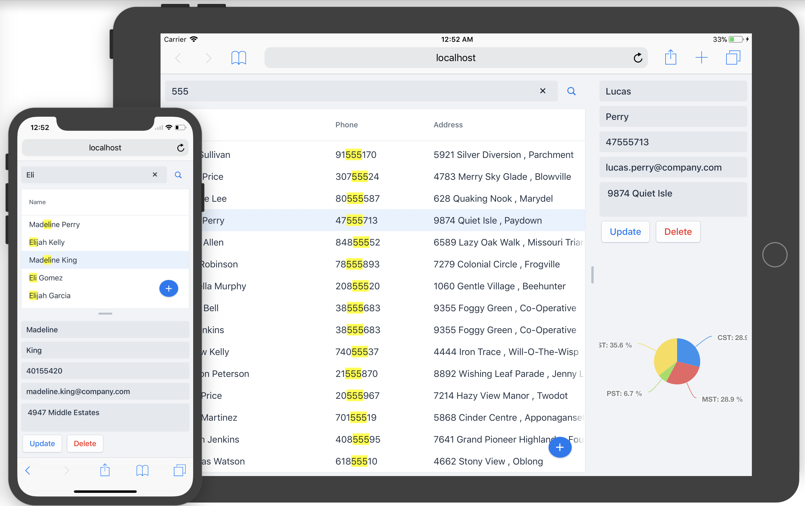

[](https://travis-ci.org/amahdy/polymer-webcomponent)

# Polymer App with Web Components

A concept of an app built with Polymer and Web Components, with possibilities to query and manipulate data, and works totally offline.

You can try the [online demo](https://amahdy.github.io/polymer-webcomponent/), and you can also [reset the local modifications](https://amahdy.github.io/polymer-webcomponent/?resetdemo) at anytime.




## Step by step, building similar app

Coming soon.

## Try out this application

Make sure you have [Bower](https://bower.io) and [Polymer CLI](https://www.npmjs.com/package/polymer-cli) installed. Clone this project locally then:

### Installing Dependencies

Install Bower dependencies
```bash
$ polymer install
```

### Running Your Application

Start the application on port 8080
```bash
$ polymer serve --port 8080
```

### Viewing Your Application

The application will be available on this address by default: [http://localhost:8080](http://localhost:8080).

### Resetting Local Modiciations

Modifications done in the app are persisted in the brwoser, you can reset them using `?resetdemo`, for example: [http://localhost:8080/?resetdemo](http://localhost:8080/?resetdemo)

### Running Tests

Tests can be run locally by visiting this URL: [http://localhost:8080/components/polymer-wc-app/test/](http://localhost:8081/components/polymer-wc-app/test/).

You can also run tests using command line
```bash
$ polymer test
```